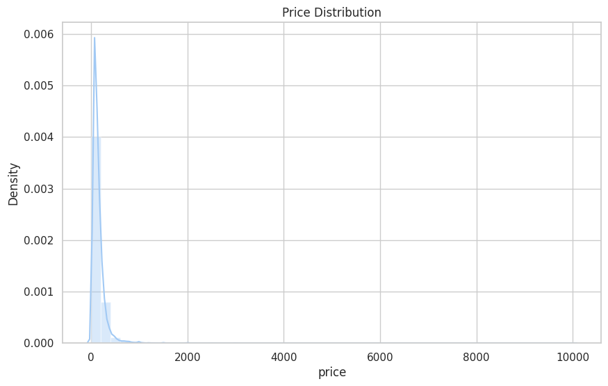
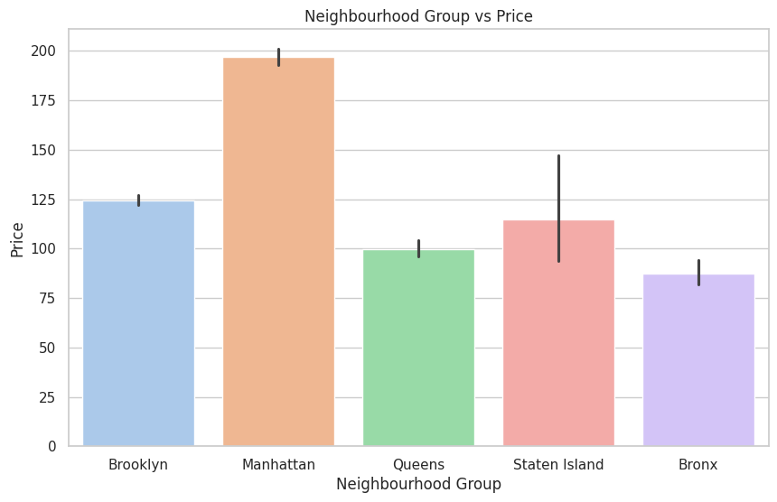
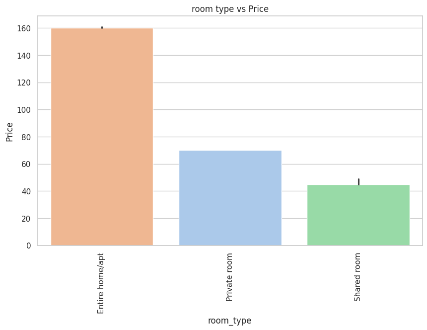
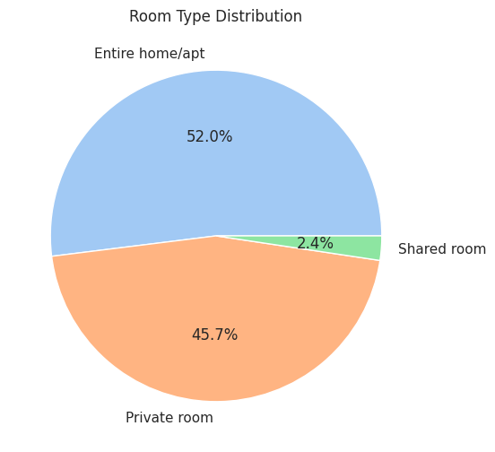
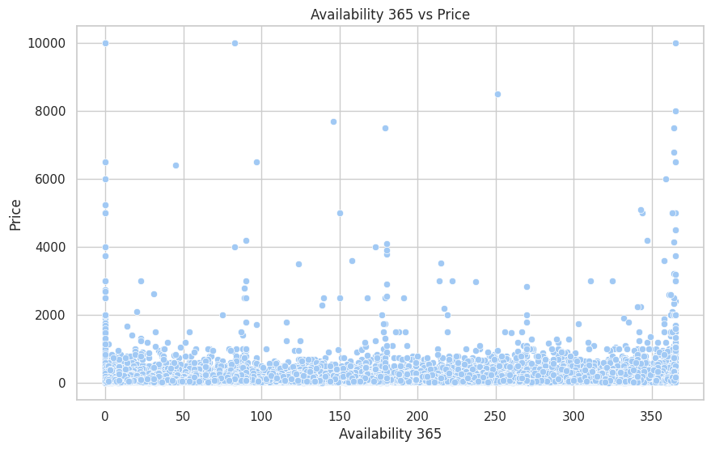
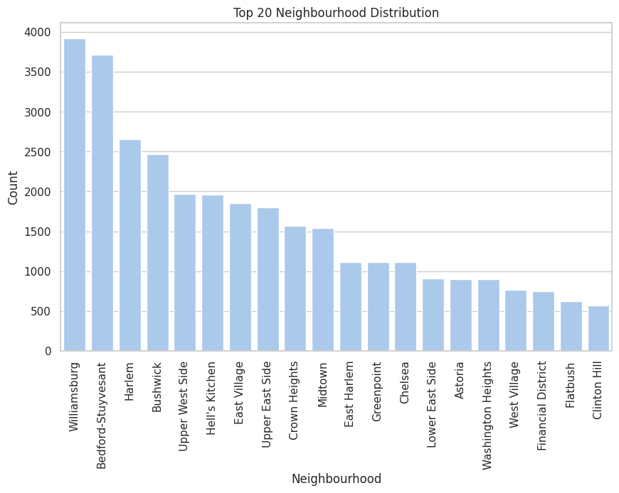

#  Airbnb Data Analysis | Pricing & Demand Insights

##  Problem Statement
Airbnb hosts and stakeholders often struggle to determine optimal pricing and understand demand patterns across different locations and property types.

This project analyzes Airbnb listing data to uncover **key factors influencing pricing, availability, and customer preferences**, enabling **data-driven decision-making** for maximizing revenue and occupancy.

---

##  Objective
- Identify key drivers of Airbnb pricing
- Analyze demand patterns across neighborhoods
- Understand the impact of room types on pricing
- Derive actionable business insights for hosts

---

##  Dataset
- Source: Kaggle Airbnb NYC Dataset  
- Records: ~48,000 listings  
- Features:
  - Price
  - Room Type
  - Neighborhood Group
  - Availability (365 days)
  - Reviews & Ratings

🔗 Dataset Link:  
https://www.kaggle.com/datasets/dgomonov/new-york-city-airbnb-open-data

---

##  Tools & Technologies
- Python
- Pandas
- NumPy
- Matplotlib
- Seaborn
- Jupyter Notebook

---

##  Key Analysis Performed
- Data Cleaning & Missing Value Handling
- Outlier Detection (Pricing anomalies)
- Univariate Analysis (Price, Availability, Room Types)
- Bivariate Analysis (Price vs Location, Room Type vs Price)
- Demand & Availability Trends

---

##  Key Insights (Business-Driven)

###  Pricing Insights
- Listings in **Manhattan are ~2–3x more expensive** than other boroughs, driven by tourism demand.
- **Entire homes/apartments command the highest prices**, making them ideal for premium pricing strategies.

###  Location-Based Insights
- Manhattan dominates high-price listings, while **Queens and Brooklyn offer budget-friendly options**.
- Certain neighborhoods show **price clustering**, indicating localized demand hotspots.

###  Room Type Insights
- Private rooms dominate mid-range pricing, suggesting strong demand from budget-conscious travelers.
- Shared rooms are least preferred, indicating limited demand.

###  Availability & Demand
- Listings with **low availability tend to have higher prices**, suggesting higher occupancy rates.
- High availability listings may indicate lower demand or overpricing.

---

##  Sample Visualizations

> *(Add your screenshots in `images/` folder and update paths below)*



Majority of listings are priced below $200, with a right-skewed distribution indicating presence of high-price outliers. 

 

Manhattan listings are significantly more expensive than other boroughs, showing a strong location-driven pricing pattern



Entire homes/apartments command the highest prices, while shared rooms remain the most affordable option


Private rooms dominate the listings, indicating strong demand from budget-conscious travelers.


Listings with lower availability tend to have higher prices, suggesting higher demand and occupancy rates



A small number of neighborhoods dominate listings, indicating concentrated demand in specific areas.
---

##  Business Recommendations

-  Hosts in high-demand areas (e.g., Manhattan) can **increase pricing by 10–20%** during peak seasons.
-  Investing in **entire property listings yields higher revenue potential**.
-  Optimize pricing for low-availability listings to maximize occupancy.
-  Budget listings in outer boroughs can compete by focusing on **value pricing strategies**.

---

##  Project Structure
airbnb-analysis/
│
├── README.md
├── requirements.txt
├── .gitignore
│
├── notebooks/
│   └── airbnb_analysis.ipynb
│
├── images/
|   └── availability_vs_price.png
│   └── price_by_neighborhood.png
│   └── price_distribution.png
│   └── room_type_distribution.png
│   └── room_type_price.png
│   └── top_neighborhoods.png
│
└── results/
    └── insights/

---

##  How to Run

```bash
git clone https://github.com/your-username/airbnb-analysis.git
cd airbnb-analysis
pip install -r requirements.txt
jupyter notebook